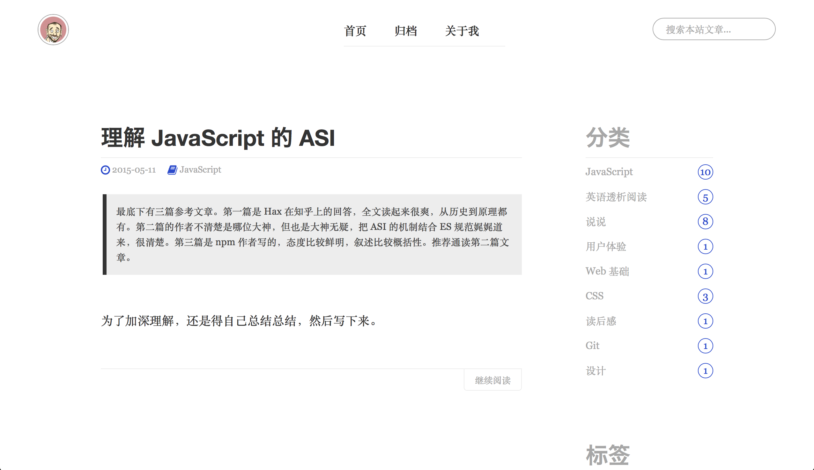

## Preview


## Installation
Go to the `your_hexo_root_dir/themes` directory, clone this repo:     
```
git clone git@github.com:sunaiwen/hexo-theme-plain.git
```

Edit the `_config.yaml` which is under `your_hexo_root/dir` with this setting:     
```
theme: hexo-theme-plain
```

And Finally run:    
```
hexo generate
```
